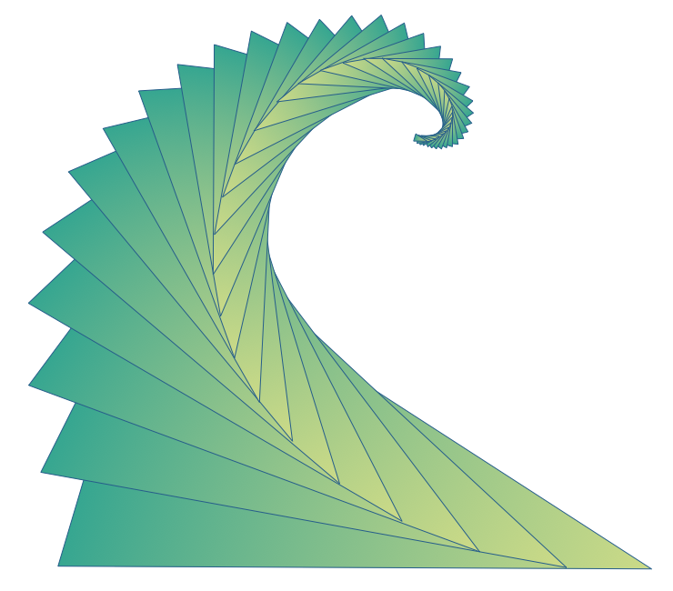

# Logo

The logo for the intent programming ecosystem is the "fractal fan."

It builds from an easy shape--a balanced, golden-mean triangle--replicated simply but with care. It suggests:

* An unfurling leaf

    Living systems and organic growth are a good model for software. Nature is familiar, modest, and patient--yet superbly sophisticated, adaptive, and robust. Leaves energize ecosystems, scrub waste, signal stress, and feed and delight people.

* A recursive spiral

    Fractals cleanly encapsulate complexity and manifest patterns in terse, distilled formulas. They invite attention to detail, mathematical rigor, and science. They're beautiful at all levels.

* A wave

    The mindset and techniques embodied by intent are the wave of the future. Waves build and resonate.